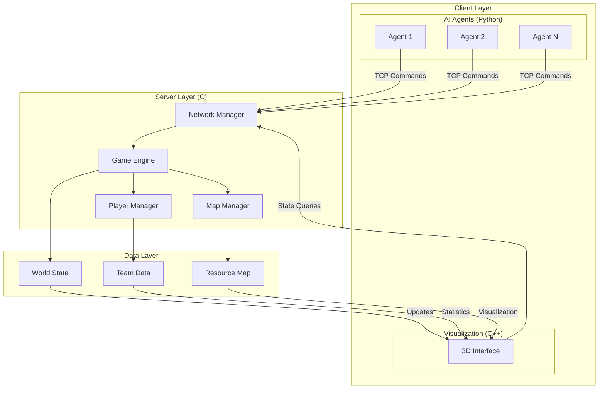

# System Architecture

## Overview

Zappy is a high-performance, multi-agent simulation platform built with a modular client-server architecture. The system enables real-time interaction between intelligent AI agents, a robust C server, and a modern 3D graphical interface.

## Architecture Diagram

## Core Components

### 1. Game Server (C)

The server is the authoritative component managing all game logic and world state.

**Responsibilities:**
- Real-time world simulation and physics
- Multi-client network management (async I/O)
- Game rule enforcement and validation
- Resource distribution algorithms
- Event broadcasting and state synchronization

**Key Modules:**
- **Network Manager:** Handles client connections, command queues, and asynchronous I/O.
- **Map Manager:** Manages the world grid, resource spawning, and tile entities.
- **Player Manager:** Tracks player state, inventory, and actions.

### 2. 3D Graphical Interface (C++)

A modern, component-based architecture for real-time 3D visualization using Raylib/OpenGL. Features include:
- Real-time rendering and camera controls
- Dynamic library loading for graphics abstraction
- Modular UI system
- Performance optimizations (LOD, culling)

### 3. AI Client System (Python)

Sophisticated agent architecture with behavioral state machines and advanced AI algorithms:
- Asynchronous network communication
- Behavioral state machines for complex decision making
- A* pathfinding and dynamic obstacle avoidance
- Encrypted team communication

## File Structure

- `src/Server/` — C server implementation
- `src/GUI/` — C++ graphical interface
- `src/AI/` — Python AI client
- `src/Shared/` — Shared interfaces and dynamic library loader

## Communication Protocols

- **Server-AI Protocol:** Text-based commands, state synchronization, action costs
- **Server-GUI Protocol:** Specialized for visualization, real-time updates

## Design Patterns

- **Observer:** GUI state updates
- **Strategy:** Adaptive AI behaviors
- **Command:** Server command processing
- **Factory:** Dynamic component creation

## Key Technologies

- **Server:** C, POSIX sockets, event-driven model
- **GUI:** C++, Raylib, dynamic library loading
- **AI:** Python, asyncio, decision algorithms

## Libraries

- **RaylibCPP:** C++ wrapper for Raylib (3D rendering, input, camera)
- **RayGUICPP:** C++ wrapper for raygui (UI widgets, dialogs)
- **DLLoader:** Dynamic library loader for modularity

## Data Flow

1. **Server → AI:** Game state, action results
2. **AI → Server:** Player commands
3. **Server → GUI:** Full game state for visualization
4. **GUI → Server:** Information requests only

## Main Game Mechanisms

- **Player Lifecycle:** Connect, join team, explore, collect, evolve, possible death by starvation
- **Resource Generation:** Randomized, periodic, type-dependent
- **Energy System:** Players consume food over time; starvation leads to death
- **Player Communication:** Broadcast system with directional context

---

This document provides a technical overview of Zappy's architecture. For detailed protocol and module documentation, see the dedicated sections.
