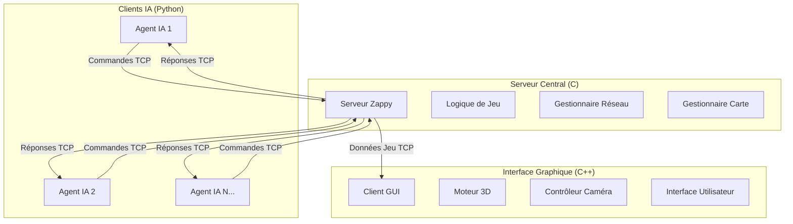

# Architecture du Projet Zappy

## Vue d'ensemble

Zappy est conçu selon une architecture client-serveur modulaire permettant la communication entre plusieurs composants distincts via des protocoles réseau standardisés.

## Architecture Globale



## Composants Principaux

### 1. Serveur (C)

**Responsabilités :**
- Gestion de l'état du jeu global
- Traitement des commandes clients
- Simulation temporelle et règles du jeu
- Communication réseau multi-clients

**Modules clés :**

#### Gestionnaire Réseau (`network/`)
```c
typedef struct server_s {
    int nfds;                    // Nombre de descripteurs de fichiers
    int s_fd;                    // Socket serveur
    client_t *client;            // Liste des clients connectés
    graphical_client_t *graphical_clients; // Clients graphiques
    poll_manager_t *poll_manager; // Gestionnaire de polling
} server_t;
```

#### Gestionnaire de Carte (`map/`)
```c
typedef struct tile_s {
    int food;           // Nourriture sur la case
    int linemate;       // Ressource linemate
    int deraumere;      // Ressource deraumere
    int sibur;          // Ressource sibur
    int mendiane;       // Ressource mendiane
    int phiras;         // Ressource phiras
    int thystame;       // Ressource thystame
    player_t *players;  // Joueurs sur la case
} tile_t;
```

#### Gestionnaire de Joueurs (`player/`)
```c
typedef struct player_s {
    int id;             // Identifiant unique
    int x, y;           // Position sur la carte
    int orientation;    // Direction (North, East, South, West)
    int level;          // Niveau du joueur
    int food;           // Nourriture possédée
    // ... autres ressources
    char *team_name;    // Nom de l'équipe
} player_t;
```

### 2. Interface Graphique (C++)

**Architecture Orientée Composants :**

#### GameLoop Principal
```cpp
class GameLoop : public IGraphicalContextObserver {
private:
    std::shared_ptr<IGraphicsLib> m_graphics;    // Abstraction graphique
    std::shared_ptr<IGuiLib> m_gui;              // Interface utilisateur
    std::shared_ptr<Renderer> m_renderer;        // Moteur de rendu
    std::shared_ptr<CameraController> m_camera;  // Contrôle caméra
    std::shared_ptr<UIRenderer> m_uiRenderer;    // Rendu UI
};
```

#### Système de Bibliothèques Dynamiques
```cpp
class LibraryManager {
private:
    std::unordered_map<std::string, void*> loadedLibraries;
    
public:
    template<typename T>
    std::shared_ptr<T> getInterface(const std::string& libraryName);
};
```

### 3. Intelligence Artificielle (Python)

**Architecture Comportementale :**

#### Agent Principal
```python
class Agent:
    def __init__(self, ip, port, team, agent_id=0):
        self.decisionManager = DecisionManager(self)      # Prise de décision
        self.broadcastManager = BroadcastManager(self)    # Communication
        self.socketManager = SocketManager(self.sock)     # Réseau
        self.current_behaviour = "Dyson"                  # Comportement actuel
```

## Structure des fichiers

Le code source est organisé comme suit :

- `src/Server/` - Implémentation du serveur en C
  - `main.c` - Point d'entrée
  - `include/` - En-têtes du serveur
  - `network/` - Gestion réseau et protocoles
  - `map/` - Système de carte et tiles
  - `player/` - Gestion des joueurs
  - `command/` - Traitement des commandes

- `src/GUI/` - Implémentation de l'interface graphique en C++
  - `main.cpp` - Point d'entrée
  - `GameLoop.cpp/.hpp` - Boucle principale
  - `renderer/` - Moteur de rendu 3D
  - `cameraController/` - Gestion de la caméra
  - `network/` - Communication avec le serveur
  - `textureManager/` - Gestion des textures

- `src/AI/` - Implémentation du client IA en Python
  - `main.py` - Point d'entrée
  - `agent/` - Logique des agents
  - `parser/` - Analyse des arguments
  - `logger/` - Système de logging
  - `utils/` - Utilitaires et chiffrement

- `src/Shared/` - Code partagé entre les composants
  - Interfaces abstraites
  - Gestionnaire de bibliothèques dynamiques

## Protocoles de Communication

### Protocole Serveur-IA
- Communication basée sur des commandes textuelles
- Chaque commande a un coût temporel spécifique
- Gestion des états de jeu synchronisés

### Protocole Serveur-GUI
- Commandes spécialisées pour l'affichage
- Mise à jour en temps réel de l'état visuel
- Synchronisation des données de jeu

## Patterns de Conception

- **Observer Pattern** : Mise à jour de l'interface graphique
- **Strategy Pattern** : Comportements d'IA adaptatifs
- **Command Pattern** : Gestion des commandes serveur
- **Factory Pattern** : Création dynamique des composants
  - ...

## Technologies utilisées

- **Serveur** : C, sockets, gestion des threads
- **GUI** : C++, bibliothèque graphique
- **IA** : Algorithmes de prise de décision, stratégies

## Bibliothèques utilisées

Le projet utilise plusieurs bibliothèques spécifiques :

### RaylibCPP
Une encapsulation C++ de la bibliothèque Raylib pour faciliter le rendu graphique 3D dans l'interface GUI. La bibliothèque fournit des classes pour :
- Gestion des fenêtres
- Rendu de formes et textures
- Gestion des entrées utilisateur
- Manipulation de la caméra 3D

### RayGUICPP
Une encapsulation C++ de la bibliothèque raygui pour créer l'interface utilisateur du client GUI. Elle offre :
- Des widgets d'interface utilisateur
- Des contrôles interactifs
- Des boîtes de dialogue
- Des layouts et groupes

### DLLoader
Un système de chargement dynamique de bibliothèques qui permet :
- Le chargement de bibliothèques à l'exécution
- L'abstraction de l'implémentation graphique
- L'interchangeabilité des modules

## Flux de données

Les données circulent entre les composants comme suit :

1. **Serveur → IA** : État du jeu, résultats des actions
2. **IA → Serveur** : Commandes et actions du joueur  
3. **Serveur → GUI** : État complet du jeu pour visualisation
4. **GUI → Serveur** : Requêtes d'information uniquement (pas d'action)

## Mécanismes de jeu principaux

### Cycle de vie du joueur
1. Connexion au serveur et rejoindre une équipe
2. Exploration et collecte de ressources
3. Évolution par incantation
4. Mort éventuelle par manque de nourriture

### Génération et distribution des ressources
Les ressources sont générées aléatoirement sur la carte avec une distribution qui dépend du type de ressource. La régénération se produit périodiquement en fonction de la fréquence du serveur.

### Système d'énergie
Les joueurs consomment de la nourriture au fil du temps. Si un joueur n'a plus de nourriture, il meurt et est supprimé du jeu.

### Communication entre joueurs
Les joueurs peuvent communiquer entre eux via un système de diffusion qui permet à un joueur d'envoyer un message à tous les autres joueurs. Les messages sont reçus avec une indication de direction pour simuler une communication réaliste.
