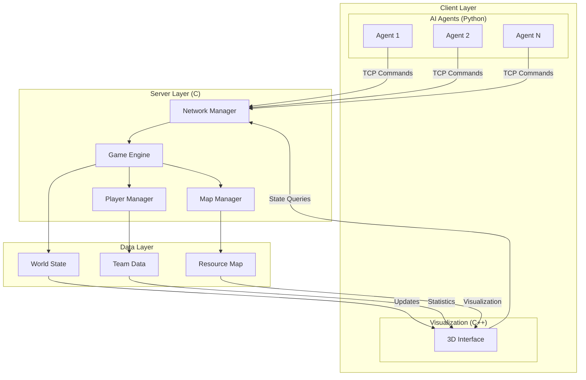

# System Architecture

## Overview

Zappy is a high-performance, multi-agent simulation platform built with a modular client-server architecture. The system enables real-time interaction between intelligent AI agents, a robust C server, and a modern 3D graphical interface.

## Architecture Diagram


```mermaid
flowchart TB
    subgraph "Client Layer"
        subgraph "AI Agents (Python)"
            AI1[Agent 1]
            AI2[Agent 2]
            AI3[Agent N]
        end
        subgraph "Visualization (C++)"
            GUI[3D Interface]
        end
    end
    subgraph "Server Layer (C)"
        NET[Network Manager]
        GAME[Game Engine]
        MAP[Map Manager]
        PLAYER[Player Manager]
    end
    subgraph "Data Layer"
        WORLD[World State]
        TEAMS[Team Data]
        RESOURCES[Resource Map]
    end
    AI1 -->|TCP Commands| NET
    AI2 -->|TCP Commands| NET
    AI3 -->|TCP Commands| NET
    GUI -->|State Queries| NET
    NET --> GAME
    GAME --> MAP
    GAME --> PLAYER
    GAME --> WORLD
    PLAYER --> TEAMS
    MAP --> RESOURCES
    WORLD -->|Updates| GUI
    TEAMS -->|Statistics| GUI
    RESOURCES -->|Visualization| GUI
```

## Core Components

## Core Components

### 1. Game Server (C) - Architecture Modulaire Avancée

Le serveur constitue le composant central avec une architecture modulaire haute performance.

**Modules Principaux :**
- **`src/Server/network/`** : Gestionnaire réseau asynchrone avec `select()` et gestion des buffers circulaires
- **`src/Server/map/`** : Moteur de monde torique avec algorithmes de génération de ressources intelligents
- **`src/Server/player/`** : Système de gestion des joueurs avec états complexes et inventaires
- **`src/Server/command/`** : Processeur de commandes avec validation, file d'attente et timing précis
- **`src/Server/graphical_command/`** : API spécialisée pour la communication GUI optimisée

**Fonctionnalités Avancées :**
- **Gestion des Rituels :** Système d'incantation collaborative avec conditions par niveau (1-8)
- **Optimisations Performance :** Pool de mémoire, cache des calculs fréquents, algorithmes O(1) pour les opérations critiques
- **Robustesse Réseau :** Gestion des déconnexions, timeouts configables, reconnexion automatique
- **Métriques Temps Réel :** Monitoring des performances, statistiques de connexion, profiling automatique

### 2. Interface Graphique 3D (C++) - Système de Rendu Sophistiqué

Architecture basée sur des patterns de conception avancés avec système de chargement dynamique.

**Architecture Technique :**
- **`src/GUI/renderer/`** : Moteur de rendu 3D avec LOD (Level of Detail) adaptatif
- **`src/GUI/ui/`** : Interface utilisateur modulaire avec Factory Pattern et Provider Pattern
- **`src/GUI/shared/`** : Système DLLoader pour le chargement dynamique des bibliothèques
- **`src/GUI/network/`** : Client réseau optimisé pour la réception des données temps réel
- **`src/GUI/gameController/`** : Logique de contrôle de jeu et gestion des états

**Optimisations Visuelles :**
- **Rendu Adaptatif :** Système LOD automatique basé sur la distance et la densité
- **Effets Visuels :** Animations fluides, particules, éclairage dynamique
- **Performance :** Frustum culling, occlusion culling, batching intelligent des objets
- **Interface Modulaire :** Fenêtres spécialisées (CarteWindow, JoueurWindow, EquipeWindow, RessourcesWindow)

### 3. Système d'IA (Python) - Agents Autonomes Avancés

Architecture basée sur des machines à états comportementales avec algorithmes d'optimisation.

**Modules Spécialisés :**
- **`src/AI/decision_manager.py`** : Gestionnaire de décisions avec algorithmes adaptatifs
- **`src/AI/broadcast_manager.py`** : Communication inter-agents avec chiffrement AES-256
- **`src/AI/socket_manager.py`** : Gestion réseau asynchrone robuste avec reconnexion
- **`src/AI/behaviors/`** : États comportementaux (BigDyson, Collecting, Rallying, Exploring)

**Algorithmes Avancés :**
- **Pathfinding A\*** : Navigation optimisée avec évitement d'obstacles dynamiques
- **Gestion Ressources :** Algorithmes d'optimisation pour la collecte et la distribution
- **Communication Sécurisée :** Protocole de chiffrement AES avec authentification
- **Apprentissage Adaptatif :** Ajustement des stratégies basé sur l'historique des performances

## File Structure

- `src/Server/` — C server implementation
- `src/GUI/` — C++ graphical interface
- `src/AI/` — Python AI client
- `src/Shared/` — Shared interfaces and dynamic library loader

## Communication Protocols

### Protocoles de Communication Avancés

**Server-AI Protocol (TCP):**
- **Format:** Commandes textuelles avec paramètres structurés
- **Durées:** Chaque action a un coût en ticks du serveur (mouvement: 7 ticks, incantation: 300 ticks)
- **Gestion d'Erreurs:** Codes d'erreur spécialisés (`ko`, `dead`, timeouts)
- **Sécurité:** Validation stricte des commandes, protection contre les attaques par déni de service
- **Exemples:** 
  ```
  Client -> Server: "Forward"
  Server -> Client: "ok" (après 7 ticks)
  ```

**Server-GUI Protocol (TCP spécialisé):**
- **Optimisé Temps Réel:** Mise à jour différentielle pour réduire la bande passante
- **Données Structurées:** État complet du monde, positions des joueurs, statistiques des équipes
- **Events:** Notifications d'événements importants (incantations, morts, naissances)
- **Performance:** Compression des données, envoi uniquement des changements

**Communication Inter-IA (Broadcast):**
- **Chiffrement:** Protocole AES-256 pour la sécurité des communications d'équipe
- **Directionnalité:** Messages orientés selon la position relative des agents
- **Coordination:** Protocoles de synchronisation pour les actions collectives

## Design Patterns et Architecture

### Patterns Implémentés

**Observer Pattern:**
- **GUI :** Mise à jour automatique des vues lors des changements d'état du jeu
- **MapRenderer :** Observation des changements de contexte graphique pour optimiser le rendu

**Strategy Pattern:**
- **AI Behaviors :** Différentes stratégies comportementales (BigDyson, Collector, Explorer)
- **Rendering :** Stratégies de rendu adaptatives selon le niveau de zoom et les performances

**Command Pattern:**
- **Server :** Traitement uniforme des commandes avec validation et exécution asynchrone
- **AI :** Queue de commandes avec priorités et gestion des échecs

**Factory Pattern:**
- **GUI Components :** Création dynamique des fenêtres et composants d'interface
- **Strategy Creation :** Fabrication des stratégies de comportement et de rendu

**Bridge Pattern:**
- **DLLoader :** Découplage entre l'abstraction graphique et l'implémentation (Raylib)
- **Network :** Séparation entre protocoles de communication et implémentations réseau

**Singleton Pattern:**
- **LibraryManager :** Accès centralisé aux bibliothèques dynamiques chargées
- **ModelManager :** Gestion globale des modèles 3D et textures

## Technologies et Bibliothèques

### Stack Technique Principal

**Server (C):**
- **Réseau :** POSIX sockets avec modèle événementiel `select()`
- **Architecture :** Modulaire avec séparation claire des responsabilités
- **Performance :** Optimisations mémoire, algorithmes O(1) pour les opérations critiques
- **Portabilité :** Compatible Linux/macOS avec abstractions système

**GUI (C++):**
- **Rendu :** Raylib 4.5+ avec OpenGL 3.3+ pour les performances 3D
- **Architecture :** C++17 avec RAII, smart pointers, et patterns modernes
- **Modularité :** Système DLLoader pour le chargement dynamique
- **Interface :** RayGUI avec composants personnalisés et thèmes adaptatifs

**AI (Python):**
- **Versions :** Python 3.8+ avec support asyncio natif
- **Réseau :** Connexions asynchrones avec gestion robuste des erreurs
- **Algorithmes :** NumPy pour les calculs, pathfinding A* optimisé
- **Sécurité :** Cryptography pour le chiffrement AES-256

### Bibliothèques Spécialisées

**RaylibCPP (`libs/RaylibCPP/`):**
- **Wrapper C++** moderne pour Raylib avec gestion RAII
- **API Orientée Objet** simplifiant l'utilisation des ressources
- **Gestion Automatique** de la mémoire et des contextes OpenGL
- **Extensions** pour les fonctionnalités avancées (VR, compute shaders)

**RayGUICPP (`libs/RayGUICPP/`):**
- **Interface Utilisateur** avec patterns Factory et Provider
- **Composants Avancés** : fenêtres modales, grilles de données, graphiques temps réel
- **Thèmes Dynamiques** avec support du rechargement à chaud
- **Intégration** native avec le système de rendu 3D

**DLLoader (`src/Shared/`):**
- **Chargement Dynamique** de bibliothèques avec validation
- **Gestion d'Erreurs** robuste avec fallback automatique
- **Interface Uniforme** pour différents types de bibliothèques
- **Performance** optimisée avec cache et chargement paresseux

## Data Flow

1. **Server → AI:** Game state, action results
2. **AI → Server:** Player commands
3. **Server → GUI:** Full game state for visualization
4. **GUI → Server:** Information requests only

## Main Game Mechanisms

- **Player Lifecycle:** Connect, join team, explore, collect, evolve, possible death by starvation
- **Resource Generation:** Randomized, periodic, type-dependent
- **Energy System:** Players consume food over time; starvation leads to death
- **Player Communication:** Broadcast system with directional context

---

This document provides a technical overview of Zappy's architecture. For detailed protocol and module documentation, see the dedicated sections.
