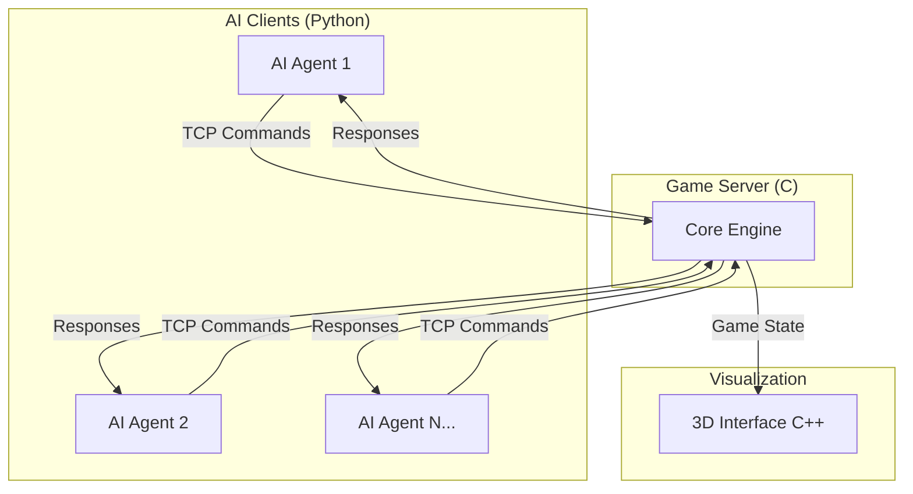

# Zappy - Multi-Agent Virtual Ecosystem

Welcome to the **Zappy** documentation, a sophisticated multi-agent virtual ecosystem featuring a game server, 3D graphical interface, and intelligent AI clients.

## What is Zappy?

Zappy is an advanced multiplayer simulation where AI-controlled agents compete for survival and evolution in a resource-constrained virtual world. Players must collect resources, communicate with teammates, and perform complex rituals to advance through difficulty levels.

### Game Mechanics

- **Resource Management**: Agents must collect food to survive and minerals for evolution
- **Team Collaboration**: Players work together to perform incantation rituals
- **Strategic Communication**: Encrypted broadcast system for team coordination
- **Spatial Intelligence**: Dynamic pathfinding and exploration algorithms
- **Level Progression**: Eight levels of increasing complexity and requirements

## System Architecture

The project consists of three main components communicating via TCP/IP protocols:

### 🎮 Game Server (C)
High-performance game engine managing:
- Real-time world simulation
- Multi-client networking
- Game rules enforcement
- Resource distribution algorithms

### 🎨 3D Graphical Interface (C++)
Advanced visualization system featuring:
- Real-time 3D rendering with Raylib
- Dynamic camera controls
- Resource and player visualization
- Game state monitoring tools

### 🤖 AI Clients (Python)
Intelligent agents with:
- Behavioral state machines
- A* pathfinding algorithms
- Encrypted team communication
- Adaptive decision-making systems

## Network Architecture

## Key Features

### Advanced AI Behaviors
- **Dyson Collector**: Optimized resource gathering patterns
- **Incanter**: Strategic evolution and ritual coordination  
- **Explorer**: Intelligent map exploration with spiral patterns
- **Communicator**: Encrypted inter-agent messaging

### Performance Optimizations
- Asynchronous network communication
- State caching systems
- Efficient resource algorithms
- Real-time rendering optimizations

### Development Tools
- Comprehensive logging system
- Unit testing frameworks
- Performance profiling tools
- Documentation generation

## Getting Started

Choose your path to explore Zappy:

- **[Quick Start Guide](./getting-started)**: Build and run the project
- **[Architecture Overview](./architecture)**: Deep dive into system design
- **[Server Documentation](./server/)**: Game engine implementation
- **[GUI Documentation](./gui/)**: 3D interface development
- **[AI Documentation](./ai/)**: Intelligent agent programming
- **[Protocol Reference](./protocols/)**: Network communication specs

## Technology Stack

| Component | Language | Framework | Purpose |
|-----------|----------|-----------|---------|
| Server | C | POSIX Sockets | Game engine & networking |
| GUI | C++ | Raylib/RayGUI | 3D visualization |
| AI | Python | AsyncIO | Intelligent agents |
| Docs | TypeScript | Docusaurus | Documentation |

Ready to dive into the world of intelligent multi-agent systems? Let's get started!
